# ClimbingBot

### 이 레포지토리는 Climbing Bot 파이프라인의 RL 모듈입니다.

- **Vision 파트**: [바로가기](https://github.com/linklingj/ClimbingRouteFinder)
- **AR 파트**: 개발 전

**클라이밍 벽을 주면, VLM이 "어느 손발을 어느 홀드로 옮길지" 순서를 짜고, 강화학습으로 학습한 물리 ragdoll이 그 순서를 실제로 올라간다.**

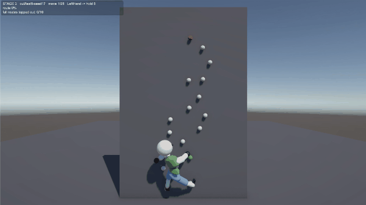

사람이 볼더링 문제를 풀 때는 두 가지 일을 한다. 먼저 벽을 보고 *"왼손을 저기, 다음에 오른발을 여기"* 라는 **순서(beta)** 를 머리로 짜고, 그 다음 몸으로 **그 동작을 실제로 수행**한다. 이 저장소는 그 두 가지를 각각 다른 모델에게 맡긴다.

```
벽 (홀드 좌표 JSON)
      │
      ▼
┌─────────────────────┐   지금 자세에서 물리적으로 닿는 홀드만 추린다
│ Candidate Generator │   (거리 · 크로스 · 스팬 · 자세 규칙)
└─────────────────────┘
      │  "왼손: 10번 / 오른손: 9번 / 왼발: 5,3번 / 오른발: 5,4번"
      ▼
┌─────────────────────┐   그중 하나를 고른다 → move 하나 → 자세 갱신 → 다시 후보 계산
│    VLM Planner      │   (벽 이미지 + 상태 JSON → structured output)
└─────────────────────┘
      │  plan.json — 목표 포즈 24개짜리 시퀀스
      ▼
┌─────────────────────┐   관절 토크 43개 + limb별 grasp/release 로
│   RL Controller     │   그 포즈를 실제 물리로 만든다 (Unity ML-Agents, PPO)
└─────────────────────┘
```

핵심은 **역할 분리**다. VLM은 물리를 모르고, RL은 홀드를 고르지 않는다. VLM은 "어디로"만 정하고, RL은 "어떻게"만 배운다. 둘은 JSON 하나로만 붙어 있어서 따로 갈아끼울 수 있다.

---

## 시연

| Stage 1 — 학습 (한 동작) | Stage 1 — 학습된 정책 |
|:--:|:--:|
| 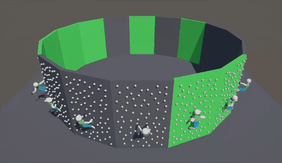 | 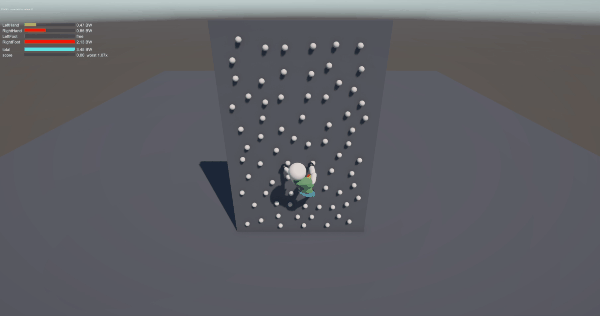 |
| **Stage 2 — 학습 (연결된 동작)** | **Stage 2 — 추론** |
| 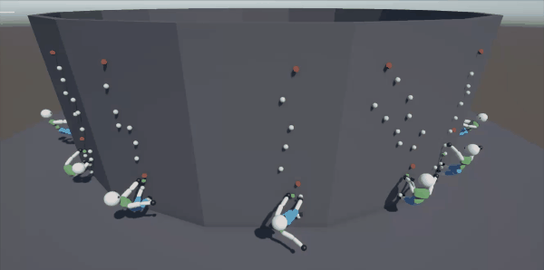 |  |

Stage 1은 **한 move**를 배운다(한 limb을 한 홀드로). Stage 2는 그 정책을 이어받아 **VLM이 짠 24 move짜리 루트 전체**를 올라간다.

---

## 1. 어떻게 도는가

### 1-1. 후보 추리기 — VLM에게 벽 전체를 맡기지 않는다

VLM에게 "여기서 다음 동작은?"이라고 벽 전체를 던지면, 2 m 떨어진 잘못된 동작을 고를 수 있다. 그래서 **모델이 보기 전에 규칙을 통해 가능한 경우의 수를 선택한다.** 

규칙 5가지:

| 규칙 | 내용 |
|---|---|
| 리치 | 손은 한 번에 1.5 m, 발은 1.3 m까지 |
| 상승 | 손은 내려가지 않고, 어떤 limb도 몸의 최하단 아래로 가지 않는다 |
| 자세 | 가장 낮은 손이 가장 높은 발보다 0.25 m 이상 위 (접히지 않기) |
| 크로스 | 왼손은 오른손 왼쪽, 왼발은 오른발 왼쪽 |
| 스팬 | 손–발 최대 거리 2.05 m (발을 두고 손만 뻗어 몸이 찢어지는 경우) |


### 1-2. VLM은 한 번에 한 move만 정한다

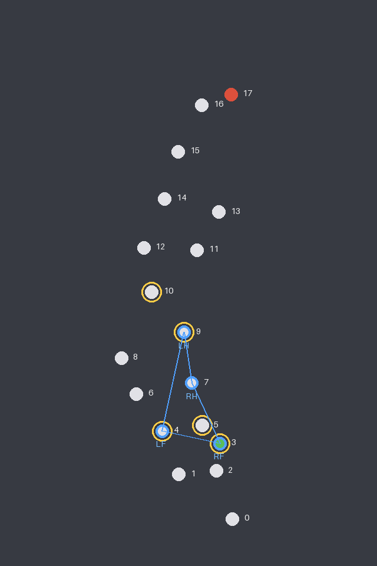

모델이 매 요청마다 받는 것:

- **이미지** — 홀드 id, 현재 네 limb(파란 링 + LH/RH/LF/RF), **지금 닿는 후보(노란 링)**
- **JSON** — 목표 top 홀드, 현재 자세, 루트의 모든 홀드 좌표, limb별 후보 목록,
  **자신의 직전 3 move**(history).
- **스키마** — `moving_limb`과 `target_hold_id`가 **후보 목록으로 enum 고정**된 structured
  output. 존재하지 않는 홀드나 잘못된 문자열 차단.

답이 오면 같은 규칙으로 다시 검증하고, 틀리면 **거부 이유를 붙여 재요청**한다. 2회까지 재시도하고 그래도 안 되면
greedy fallback으로 처리한다

오른쪽 그림이 실제로 모델에게 가는 이미지다(8번째 move 시점, `out/test5-seed0`).

### 1-3. RL은 홀드를 고르지 않는다

plan의 각 move는 "**어떤 팔/다리를 어느 홀드로 움직여라**"로 변환돼 RL 컨트롤러에게 간다.ㅜ잡기는 자기에게 배정된 홀드의 grasp 반경 안에서만 action mask가 열리므로, 탐색할 것도 순간이동할 것도 없다.

---

## 2. 왜 두 단계로 나눴는가

한 번에 "루트를 올라가라"로 학습시키면, 첫 move를 못 하는 동안 나머지 23 move는 전부 낭비다. 그래서 학습을 둘로 쪼갰다.

| | **Stage 1** | **Stage 2** |
|---|---|---|
| 에피소드 | move 1개 | 루트 1개 (평균 23.9 move) |
| 벽 | 매 에피소드 **새로 뿌리는 랜덤 벽** (홀드 70개) | VLM이 실제로 plan을 짠 벽 48개 |
| 목표 | 랜덤 limb → 랜덤 도달 가능 홀드 | plan의 move를 순서대로 |
| 지지 limb | 벽에 고정 (action mask로 잠금) | 동일 (아직) |
| 종료 | 도달 / 낙하 / 300 스텝 | 도달 시 **다음 move로 이어짐** / 낙하 / move별 300 스텝 |

| Stage 1 (`stage1-04`, 20M) | Stage 2 (`stage2-02`, 20M) |
|:--:|:--:|
| 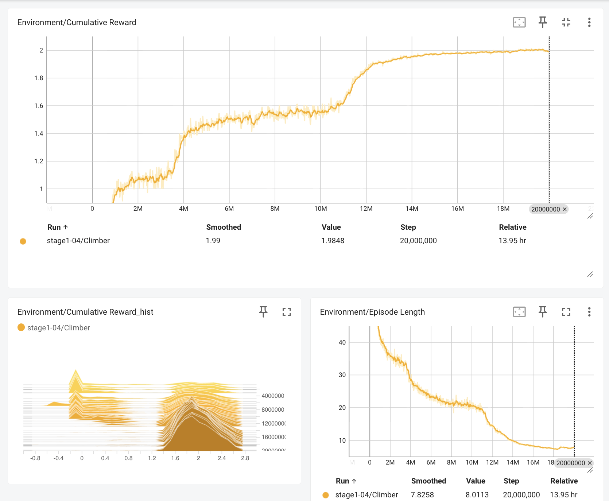 | 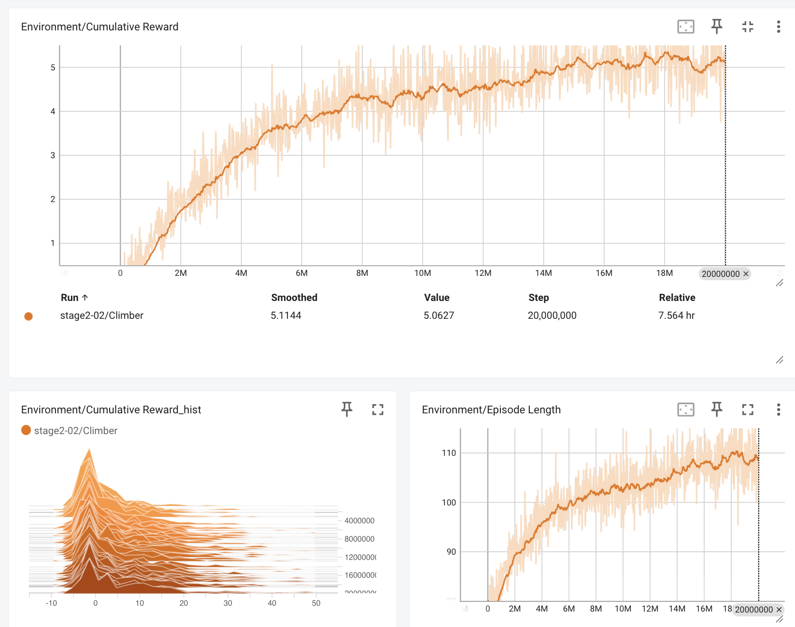 |

Stage 1은 보상 **1.99**로 수렴하고 에피소드 길이가 40 → **8 스텝**으로 줄어든다 — 한 move를
망설임 없이 해낸다는 뜻이다. Stage 2는 같은 20M에서 보상 **5.06**, 에피소드 길이는 거꾸로
**109 스텝**까지 늘어난다: 한 에피소드가 여러 move를 이어 가기 때문이고, 아직 완등에는
못 닿았기 때문이다.

---

## 3. 랜덤한 벽에 대한 일반화 성능

추후 실제 벽으로 확장시키기 위해서는 랜덤한 벽에 대한 일반화 성능에 신경썼다.

일반화 성능을 달성하기 위한 장치는 다음과 같다.

- 랜덤 벽 생성기
  - 벽 생성기는 시드를 입력하면 홀드를 랜덤하게 배치하여 벽을 만든다. Unity Spline을 사용하여 최대한 실제 클라이밍장에서 볼 법한 벽을 재현했다.

| 시드 1 | 시드 2 | 시드 3 |
|:--:|:--:|:--:|
| 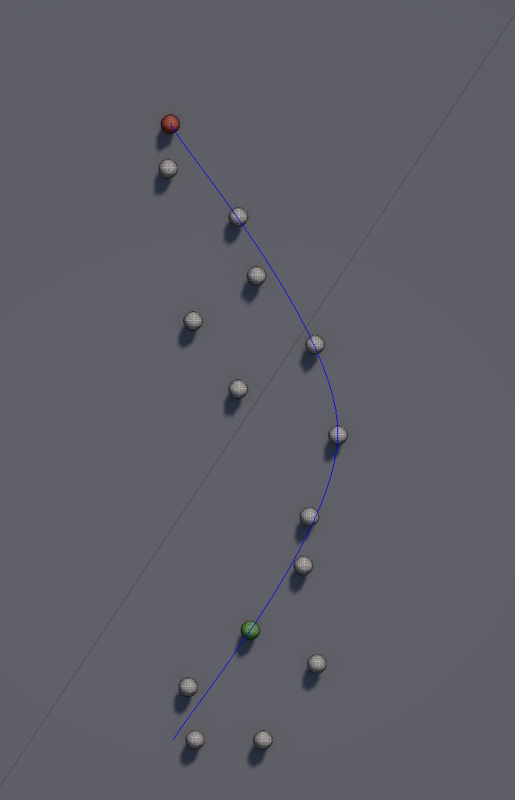 | 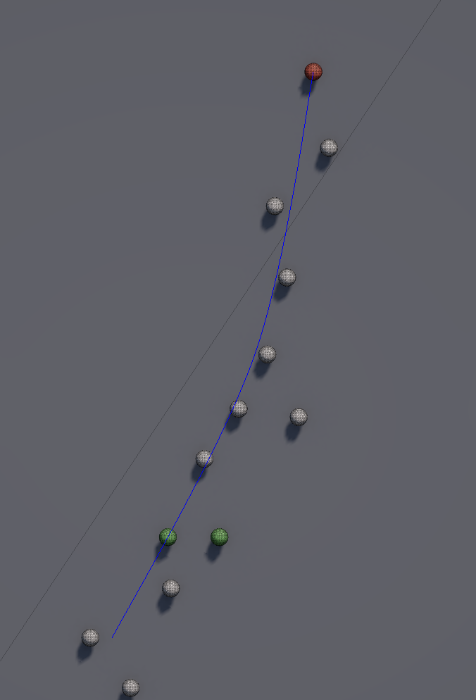 | 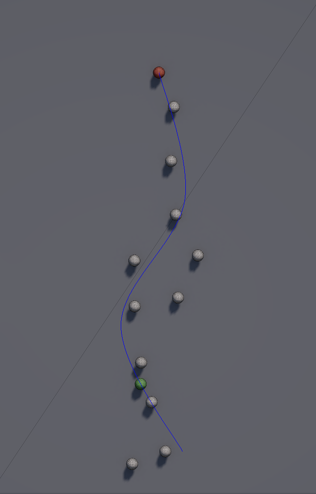 |

같은 생성기, 시드만 다르다. 파란 선이 루트 spline, 초록이 start 홀드, 빨강이 top
홀드다. VLM은 이 벽을 Scene JSON으로 받고, Stage 2는 **plan이 실제로 만들어진 그 JSON**을 다시 읽어 벽을 세운다 — 같은 시드로 재생성하면 홀드 id가 어긋날 수 있어서다.
- 상대 위치를 관측으로 사용
  - 목표는 절대 좌표가 아니라 **limb에서 목표 홀드까지의 상대 오프셋**이다. 벽이 바뀌어도 "오른손 앞 0.4 m 위"는 같은 관측이다.


---

## 4. VLM에게 요청하는 방식 비교 실험 — move 단위 재계획 vs one-shot

같은 모델, 같은 벽, 같은 검증기. **요청 방식만** 다른 두 가지를 구현해 두고 비교한다.

| | **steps (기본)** | **oneshot** |
|---|---|---|
| 요청 수 | move마다 1회 (+재시도) | 루트 전체에 1회 |
| 후보 목록 | 준다 (도달 가능한 홀드만) | **안 준다** — `limits`(리치·스팬)만 주고 모델이 직접 계산 |
| 이미지 | 매 move 갱신 (현재 자세 + 후보 링) | 시작 자세 1장 |
| 틀린 답 | 이유를 붙여 재요청 → greedy fallback | 재시도 없음. **첫 불가능한 move에서 중단** |

one-shot 프롬프트는 규칙을 더 많이 짊어진다. 후보 목록이 없으므로 "limb이 움직이는 거리는 **네가 쓴 시퀀스에서 그 시점에 잡고 있는 홀드** 기준"이라는 것까지 모델이 직접 추적해야 한다.

**현재까지의 실측** (`gpt-6-luna`, 합성 벽 50개, steps 모드, `out/test5-seed*`)

| | VLM (steps) | greedy 베이스라인 |
|---|---|---|
| 완등(top 도달) | **96%** (48/50) | 98% (49/50) |
| valid move rate | **1.000** (재시도·fallback 0) | — |
| 평균 move 수 | 23.7 | 17.5 |
| **평균 move 거리** | **0.63 m** | 0.86 m |
| 같은 limb 연속 이동 | 12 / 1187 | 26 / 874 |

합성 벽에서는 greedy도 거의 다 올라간다 — 벽이 쉽다는 뜻이고, **완등률만으로는 둘이 구별되지 않는다.** 구별되는 것은 **move의 질**이다. VLM은 move당 0.63 m를 가고 greedy는 0.86 m를 간다. Stage 2 분석에서 per-move 성공률이 리치 거리에 따라 떨어지는 것이 이미
측정됐으므로(루트 하단 0.585 m → 상단 0.692 m, +18%), **짧은 move를 쌓는 plan이 RL 컨트롤러가 실제로 수행할 수 있는 plan**이다. 그래서 이 파이프라인의 최종 지표는 plan의 완등률이 아니라 **RL이 그 plan으로 올라간 완등률**이다.

---

## 5. ML-Agents 설계

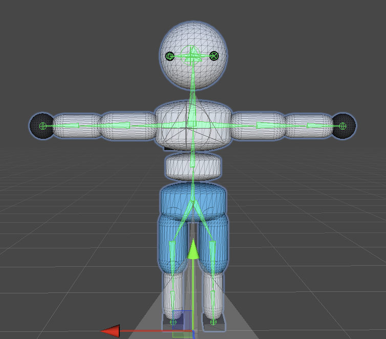

에이전트의 몸은 **body part 16개 · 구동 관절 13개**짜리 ragdoll이다. 손목은 용접이고 hips에는 관절이 없다. 오른쪽이 관절 gizmo를 켠 모습이고, 관측·행동의 차원은 전부 이 구조에서 나온다.

**관측 (256차원)** — 전부 벽 좌표계

| 묶음 | 내용 |
|---|---|
| 몸통 (11) | hips·chest 회전(쿼터니언), 전체 평균 속도 |
| 그립 (4) | limb별 잡고 있는지 |
| 목표 (16) | limb 4개 × (목표 홀드까지의 상대 오프셋 3 + 내가 명령받은 limb인지 1) |
| 신체 (225) | body part 16개 × (지면 접촉·선속도·각속도·hips 기준 상대 위치 = 10) + 구동 관절 13개 × (로컬 회전 4 + 현재 강도 1) |

hips(관절 없음)와 용접된 손목(모든 축 잠금)의 회전은 **상수 입력**이라 빼고 관찰한다.

**행동** — 연속 43개(관절 목표 회전 30 + 관절 강도 13) + 이산 4 branch × 3
(변화 없음 / 잡기 / 놓기). 이산 branch에는 마스킹이 걸린다: 잡기는 자기 홀드의 grasp 반경 안에서만, 놓기는 잡고 있을 때만.

**보상**

| 항 | 값 | 이유 |
|---|---|---|
| 접근 | +2.0 / m | **최근접 래칫**: 가까워진 거리만 지불하고 멀어지는 건 무료 |
| 성공 | +1.0 | 목표 홀드를 잡았을 때 1회 |
| 놓기 | +0.1 | 처음 손을 뗐을 때 1회 |
| 낙하 | −1.0 | hips가 move 시작 높이보다 1 m 아래로 |
| 시간 | −0.0005 / step | 빨리 끝내기 |
| 낙차 | −0.02 × (낙차−0.4 m) / step | 매달려 흔들리는 것에 처음으로 값을 매긴다 |
| 그립 하중 | −0.01 × (하중/용량 − 1) / step | 용량 초과분만 |
| 지지 limb | −0.01 / step | 지지 limb이 놓고 있을 때 (잠금 해제 시에만 발동) |

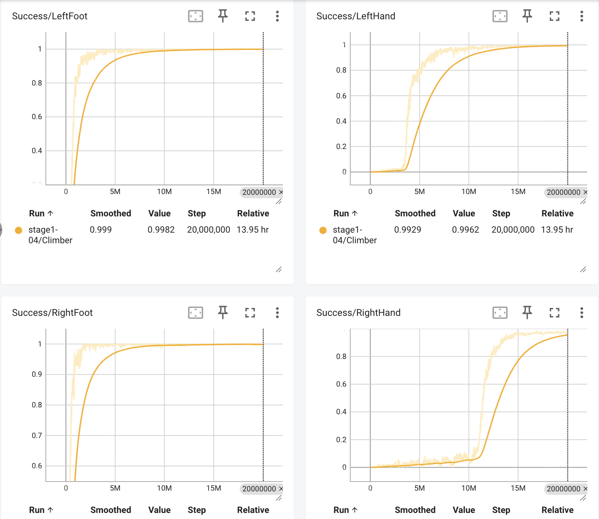

limb별 성공률 곡선(`stage1-04`, 20M). **발은 1M 스텝에 붙는데 오른손은 11M까지 0% 근처에 머문다** — 손은 놓는 순간 몸이 처져 목표에서 *멀어지고 나서야* 가까워지기 때문이다. 래칫과 놓기 보상이 정확히 이 구간을 위한 항이다.

**래칫과 놓기 보상이 이 설계의 핵심이다.** 대칭 보상(멀어지면 벌점)으로 돌린 `stage1-03`

`stage1-04`는 100% 성공률에 도달하고도 평균 0.51 m 매달린 채였고, 잡고 있는 순간의 59.7%에서 그립 용량을 초과했다 — 낙차도 하중도 **보상에 없었기 때문에** 정책이 정확히 그 구멍으로 갔다. 낙차·그립 항은 그래서 추가됐다.

---

## 6. 실행

```bash
# VLM — 벽 하나 plan
cp .env.example .env                                     # GEMINI_API_KEY / OPENAI_API_KEY
PYTHONPATH=src python -m vlm --wall 3 --out out/wall3    # move마다 재계획 (기본)
PYTHONPATH=src python -m vlm --wall 3 --oneshot          # 요청 한 번에 전체 시퀀스
PYTHONPATH=src python -m vlm --wall 3 --offline          # 키 없이 greedy 베이스라인
PYTHONPATH=src python -m vlm.selftest                    # 모델 없이 도는 검증

# RL — 학습 (프롬프트가 뜨면 해당 씬을 열고 에디터에서 Play)
mlagents-learn config/climber.yaml --run-id=stage1-06                                   # Train.unity
mlagents-learn config/climber.yaml --run-id=stage2-03 --initialize-from=stage2-02       # Train2.unity
```

보기만 할 때는 `Inference.unity`를 열고 Play만 누르면 된다 — 학습기 없이 `Assets/05ONNX`에
물린 모델로 바닥부터 오른다.

## 7. 현재 상태

- **되는 것** — Stage 1 단일 move 성공률 0.99~1.00(랜덤 벽), VLM plan 완등률 96%(합성 벽 50개, 유효 답 100%), Stage 2가 plan 시퀀스를 따라 올라가는 파이프라인 전체.
- **안 되는 것** — Stage 2 완등률. 시작 move 랜덤화를 넣고 `stage2-03`을 돌리는 중이다.
- **아직 안 푼 것** — 지지 limb 잠금(`lockSupportLimbs`).

설계 문서는 [`docs/`](docs/), 작업 기록은 [`worklog/`](worklog/)에 있다.
